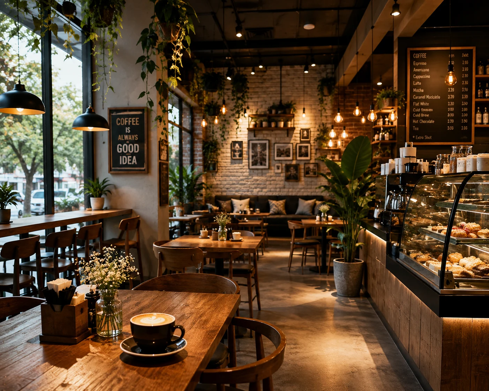
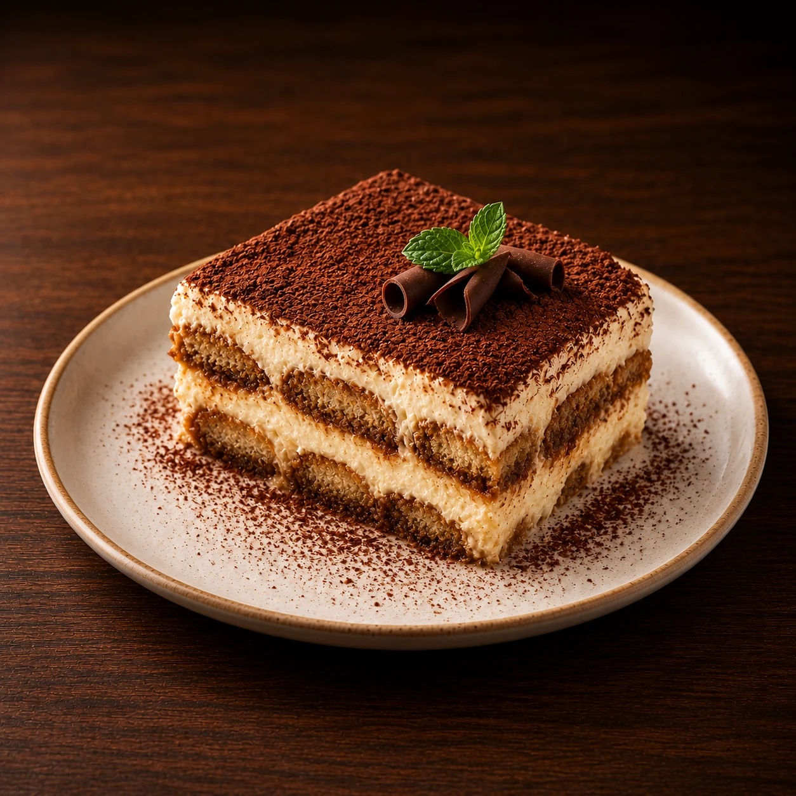
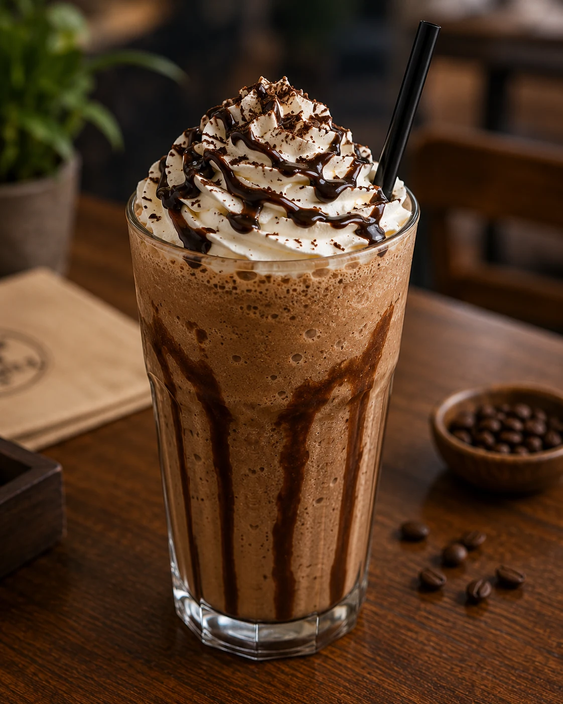

# CRÈMA HOUSE



A marketing site for a slow-roast coffee house, built as a bright editorial
rather than the usual dark luxury template. Warm paper, hand-drawn
illustration, one terracotta accent, and motion that is scroll-linked
throughout.

CRÈMA HOUSE is a fictional brand. This is a front-end project — there is no
backend, no CMS and no payment flow.

**Stack:** Next.js 15 (App Router) · React 19 · TypeScript · Tailwind CSS v4 ·
GSAP (ScrollTrigger, SplitText, DrawSVG) · Lenis

---

## Quick start

```bash
npm install
npm run dev          # http://localhost:3000
npm run build && npm start
```

Next.js 15 requires Node 18.18 or newer.

> **Do not run `npm run build` while `npm run dev` is running.** They share the
> `.next` directory and corrupt each other — the usual symptom is an unstyled
> page or a 500 on a route that compiled a moment ago. The build directory is
> configurable for exactly this reason:
>
> ```bash
> NEXT_DIST_DIR=.next-check npm run build    # type-check and build without touching .next
> ```
>
> If you do hit it: stop the server, `rm -rf .next`, start again.

---

## Routes

| Route | Contents |
| --- | --- |
| `/` | Hero · Story (abridged) · Menu (all ten, on a turning ring) · Craft · Voices (3 of 5) |
| `/story` | Masthead, three chapters, the numbers |
| `/menu` | All ten dishes as a three-column vitrine, with notes and prices |
| `/voices` | All five testimonials |
| `/reserve` | Reservation panel, hours, address |

`Menu` and `Voices` each take an `items` prop plus an optional `cta`, so one
component serves both the home-page preview and the full page. `Menu` also
takes a `variant`: `grid` is the three-column vitrine, `ring` stands the same
plates on a rotating cylinder. Nothing is duplicated between the two.

<table>
  <tr>
    <td width="25%"></td>
    <td width="25%"></td>
    <td width="25%"></td>
    <td width="25%"></td>
  </tr>
  <tr>
    <td align="center"><sub>Cappuccino</sub></td>
    <td align="center"><sub>Butter Croissant</sub></td>
    <td align="center"><sub>Classic Tiramisu</sub></td>
    <td align="center"><sub>Iced Mocha Frappé</sub></td>
  </tr>
</table>

<sup>Four of the ten. Each plate is a square crop on the ring and keeps its
shot aspect in the grid — the variety reads as composition in a vitrine and as
a wobble on a cylinder, so the two layouts crop differently.</sup>

---

## The look

| | |
| --- | --- |
| Paper | `#F8F5EF` page · `#F3EEE5` bands · white cards |
| Ink | `#222222` headlines · `#46413A` body · `#8B8378` captions |
| Accent | `#C4674C` terracotta, with a lit and a deep variant |
| Display | **Fraunces**, held at `SOFT 100, WONK 1` |
| Text | **Bricolage Grotesque** |
| Hand | **Caveat** — eyebrows, stickers, margin notes |

Fraunces is the whole point of the type: at its default axis settings it is
just another high-contrast serif, and the soft terminals plus the off-kilter
alternates are what keep the headings from reading as stock. Soft gold on cream
is the house style of every generated "luxury" site going, so the accent is
burnt clay instead — which is also the colour the illustrations are inked in, so
the accent and the artwork agree.

Nothing on the page is a flat colour. Every surface carries a gradient, a paper
tooth, or a soft warm shadow, and the shadows are warm rather than grey — a cool
shadow on cream reads as dirt.

All of it lives in one `@theme` block in `src/app/globals.css`. That file is the
single source of truth for colour, type scale, spacing, radii, shadows and
easing. The tailwind-merge scales in `src/lib/utils.ts` are kept in step with it
by hand, because a scale listed there that no longer exists silently changes
which class wins.

---

## Architecture

```
src/
├─ app/              layout · page · globals.css (all design tokens) · routes
├─ components/
│  ├─ sections/      Hero · Story · StoryFull · Menu · Craft
│  │                 Voices · Reserve · ReserveStrip · Footer
│  ├─ layout/        Nav · Wordmark · PageHeader · SmoothScroll · Grain
│  ├─ menu/          MenuCard (grid) · MenuRing + RingCard (cylinder)
│  ├─ motion/        RevealRunner · SplitHeading · Magnetic · Counter · Motes
│  ├─ media/         BackgroundVideo · RevealImage
│  ├─ illustrations/ Doodles · Florals · Foliage
│  └─ ui/            button · brand-icons
├─ hooks/            useGsap · useMediaQuery · useIsoLayoutEffect
└─ lib/              site · menu · voices · media · gsap · ease · pointer · utils
```

Content is data, not markup: `src/lib/site.ts` holds every piece of brand copy,
navigation and contact detail, `menu.ts` the ten dishes, `voices.ts` the five
testimonials. No component hard-codes the brand name.

---

## How the motion works

### Reveals are declarative

Sections never import a motion component or write a timeline. They mark an
element and the runner finds it:

```tsx
<h2 data-text="scatter">Ten things, done properly.</h2>
<p data-text="lines" data-text-delay="0.25">…</p>
<Sprig data-ill data-ill-delay="0.5" />
```

`RevealRunner` is mounted once in the root layout. It scans for `[data-text]`
and `[data-ill]`, splits the text, builds a paused GSAP timeline per element and
plays it as the element scrolls into view. Nine modes are available — `lines`,
`words`, `chars`, `flip`, `scatter`, `wipe`, `write`, `fade`, `pop` — plus
`data-text-start`, `data-text-delay` and `data-text-stagger` for the timing.
Illustrations get `ill-draw` (outlines draw on), `ill-pop`, `ill-sway`,
`ill-spin` and `ill-twinkle`.

Three things make it safe rather than merely clever:

- **Nothing is hidden by JavaScript.** The pre-hide is a CSS rule keyed on a
  `data-js` attribute that an inline `<head>` script sets before first paint — so
  copy is only ever invisible on a page where scripts actually run, the server
  HTML and the first client render agree, and a 3.5s timer in that same script
  un-hides everything if the runner never reports for duty.
- **Splitting waits for the webfont, but not forever.** Line breaks are measured,
  so a split taken before Fraunces swaps in is wrong. `document.fonts.ready`
  covers the normal case; a 1.2s timeout covers the case where a font never
  arrives, because a headline that stays invisible is a far worse failure than
  one that splits on fallback metrics.
- **The split is temporary.** Each element is re-split on resize while its reveal
  is still pending, and reverted to plain text the moment it finishes — no orphan
  spans, no stranded `will-change`, and the accessible name is intact throughout.

### One clock

`gsap.ticker` drives Lenis, and Lenis drives `ScrollTrigger.update`. Anything
continuous rides that same ticker; a second `requestAnimationFrame` loop beats
against it and produces visible jitter. Because `lagSmoothing(0)` is set
site-wide, a ticker callback receives the *real* elapsed time — a backgrounded
tab hands back its entire absence at once, so any delta-driven motion clamps it.

### One element, one engine

Nothing is animated by two systems at once. Where a component needs both a
resting arrangement and an animated one, the resting state is CSS or an inline
style and GSAP only animates on top of it — `gsap.context().revert()` restores
pre-context inline styles on every cleanup, so a layout assembled by `gsap.set`
takes itself apart on React's second mount in development.

---

## Decisions worth knowing

**The hero's headline is set in the footage.** The words are lettered into the
video, so the one thing the hero must never do is crop them. The crop is aimed
from JavaScript instead: the lettering's bounding box is measured against the
section, and the picture is placed so the words survive at any aspect ratio,
never pulling away from an edge. The picture carries no transform once it has
landed — a pointer drift or a scroll dolly would push the words back out of
frame — so the motion lives in the copy instead. Which of two layouts applies is
decided from the measured geometry, not from a breakpoint.

**The menu ring is a real cylinder.** Each plate is rotated to its share of the
circle and pushed out along the radius; the plate facing you is nearest the
viewer, so perspective alone makes it the largest and sharpest — nothing is
scaled by hand. The far half is simply not drawn, because every slot carries
`backface-visibility: hidden`, which is cheaper than sorting and cannot z-fight.
Idle rotation, scroll and the reader's hand are three numbers that sum to one
angle, and a single render pass writes the frame from it, so they can never
disagree. Plates turned away keep their tab stop: focusing one turns the ring to
bring it round.

**The illustrations share one pen.** Outlines are inked at 1.6px with
`vector-effect: non-scaling-stroke`, so a sparkle at 12px and a vine at 160px
carry the same weight. Flat colour sits *behind* the ink and is knocked a unit
or two off register, like a cheap two-colour print, and every shape is drawn as a
path rather than a `<circle>` so nothing is ever quite round.

**`reveal`, not `opacity-0`.** Every scroll-revealed element wears the `reveal`
utility: `opacity: 0`, except under `prefers-reduced-motion`, where it is
`opacity: 1`. An element only ever shown by an animation you have opted out of is
simply an invisible element.

**Never `indexOf` across the RSC boundary.** Props handed from a Server Component
to a Client Component are serialised, so the objects arriving in the client are
copies and are never identity-equal to the module's own array. `menuIndex(id)`
looks positions up by id for exactly this reason.

**Route changes reset the scroll — unless there is a fragment.** `SmoothScroll`
watches `usePathname`, jumps Lenis to the top without animating, then re-measures
every ScrollTrigger on the next frame. A deep link such as `/#menu` wins over the
reset, so the browser's own hash scroll is not immediately undone.

---

## Accessibility & performance

- `prefers-reduced-motion` is honoured end to end: timelines no-op, Lenis is
  never constructed, background video does not autoplay, and every component
  that would animate into place renders in its final state instead.
- Hover-only affordances are gated behind `@media (hover: hover) and
  (pointer: fine)`, so touch devices get the resting state rather than nothing.
- Controls are built to a 44×44 CSS pixel minimum — buttons, the menu trigger
  and the ring's own controls all sit on that floor rather than near it.
- The mobile menu traps focus while open and returns it to the trigger on close;
  the panel is `visibility: hidden` when shut, which keeps its links out of both
  the tab order and the accessibility tree.
- Form fields are never smaller than 16px, below which iOS Safari zooms the
  viewport on focus and leaves the page panned.
- Only the variable-font axes the stylesheet actually uses are requested. Every
  extra axis is carried in the file whether a rule moves it or not; dropping the
  three that were never referenced cut the font payload by 40%.
- Videos attach their `src` only as they approach the viewport and pause once
  they leave — an off-screen video decoding at 30fps is pure battery drain.
- Pointer effects write through `gsap.quickTo` and share one listener per
  section, so moving the mouse never triggers a React render.
- Production build: **200 kB First Load JS** on the home page, 103 kB shared.

---

## Media

`public/media/` holds the optimised images and video the site actually serves.
`src/lib/media.ts` maps each asset to its intrinsic dimensions and an inline
base64 blur placeholder, so `<Image>` never shifts layout or flashes empty.

`scripts/optimize-media.mjs` (`npm run media`) generated both from an original
`media/` folder. **That source folder is no longer in the repository**, so the
script cannot currently run and `src/lib/media.ts` is maintained by hand. Restore
the originals before using the pipeline again — running it against an empty
folder would emit a manifest for nothing.

---

## Known gaps

- The newsletter form is a UI stub: it validates and shows a success state, but
  is not wired to any mailing service.
- The reservation form does not submit anywhere.
- The home page has no reservation section by design — the path to booking is the
  hero action, the nav button and the footer.

---

## Licence

No licence is granted for the brand, the copy or the photography. The code is
offered as a reference.
